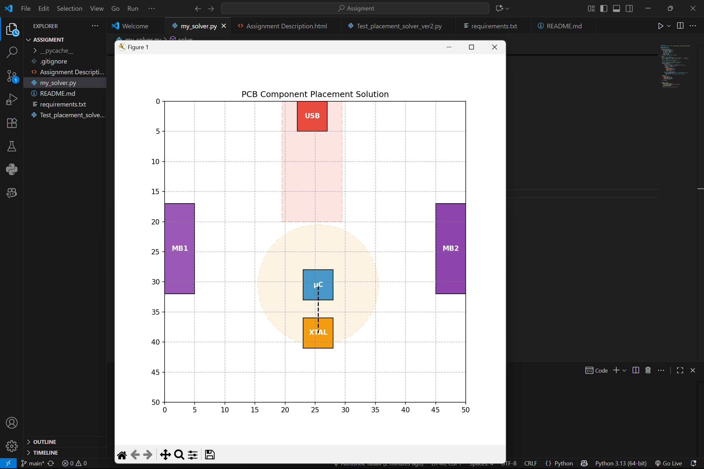

# 📌 PCB Component Placement Solver

This is my submission for the PCB component placement assignment.

## ✅ Project Overview
This project places five electronic components on a 50×50 board while following specific hardware constraints.

The components are:
- USB Connector
- Microcontroller
- Crystal
- MikroBus Connector 1
- MikroBus Connector 2

The placement must follow strict rules like:
- No overlapping components
- Some components must be on board edges
- Microcontroller and Crystal must be close (≤10 units)
- Crystal-to-micro path must avoid the USB "keep-out" zone
- The average center-of-mass must be near the center of the board

The placement is validated and visualized using the provided `Test_placement_solver_ver2.py` script.

---

## 📁 Project Files

| File | Description |
|------|-------------|
| `my_solver.py` | My main solver script that builds and validates the component placement |
| `Test_placement_solver_ver2.py` | Provided validation and visualization tool |
| `Assignment Description.html` | Assignment instructions and rules |
| `requirements.txt` | Python package needed (matplotlib) |
| `screenshot1.png` | Screenshot of successful output |
| `README.md` | This file (explains everything) |

---

## ▶️ How to Run the Project

1. Install the required Python package:
[text](requirements.txt)

2. Run the solver:
[text](my_solver.py)

3. You will see:
- Validation output in the terminal (✅ PASSED)
- A graphical plot showing the board layout
---

## 💡 My Approach

I placed edge-constrained components (USB and MikroBus connectors) on opposite edges. Then I positioned the Microcontroller near the center and placed the Crystal close to it, while making sure all constraints were satisfied.

I used the provided validation function to check my result, and I show the final layout using matplotlib.

---

## 🖼️ Output Example

Here is an example of the output (see screenshot1.png):

---

## 👤 Author

- Name: Abhishek  
- Submission Date: [24-09-2025]

---

✅ Thank you for reviewing my project!
